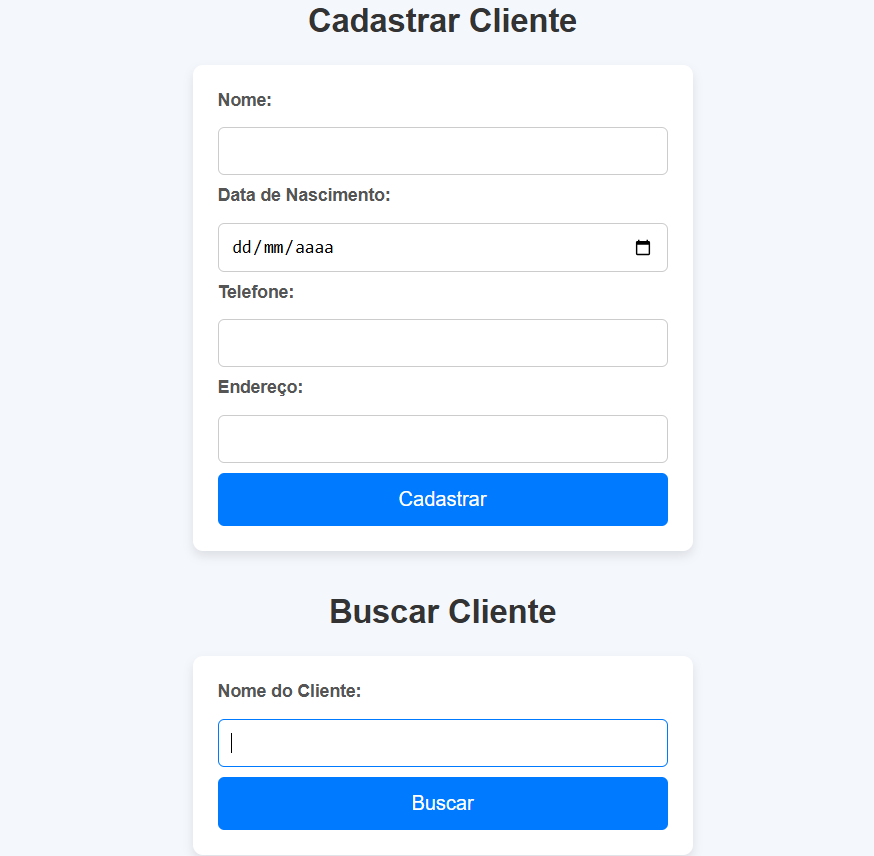

# Projeto de Extensão – PEX III: Cadastro de Clientes para Pizzaria

Este projeto integra a disciplina de Projeto de Extensão III (PEX III) do curso de Análise e Desenvolvimento de Sistemas (ADS), com foco na criação de um sistema de cadastro de clientes para uma pizzaria local. A iniciativa visa aplicar os conhecimentos técnicos adquiridos durante o curso — como desenvolvimento de sistemas, banco de dados e criação de interfaces — em um desafio real enfrentado por pequenos empreendedores.

A solução proposta tem como objetivo principal melhorar a organização do atendimento ao cliente, além de contribuir para a sustentabilidade do negócio. Atualmente, a pizzaria enfrenta dificuldades relacionadas ao uso excessivo de papel para registrar e localizar informações de clientes, utilizando cadernos físicos que tornam o processo lento e desorganizado.

Com a digitalização desse processo por meio de um sistema informatizado, será possível reduzir o consumo de papel, agilizar o atendimento, melhorar a experiência do cliente e contribuir para práticas mais sustentáveis no dia a dia do comércio local.

Conexão com os ODS:

Trabalho decente e crescimento econômico: fortalecimento do comércio local por meio da tecnologia.

Indústria, inovação e infraestrutura: implementação de soluções digitais para negócios tradicionais.

Cidades e comunidades sustentáveis: incentivo ao uso consciente de recursos e práticas mais ecológicas.

Educação de qualidade: aplicação prática dos conhecimentos adquiridos na formação acadêmica.

## 📋 Funcionalidades

- Cadastro de clientes (nome, data de nascimento, telefone, endereço)
- Busca de clientes

## 🌐 Acesse o site

Você pode acessar a interface de cadastro diretamente pelo link abaixo:

🔗 [https://lauluah.github.io/pizzaria-projeto/](https://lauluah.github.io/pizzaria-projeto/)

## 🚀 Tecnologias utilizadas

- Java
- Spring Boot
- Jakarta Validation (Bean Validation)
- HTML5, CSS3
